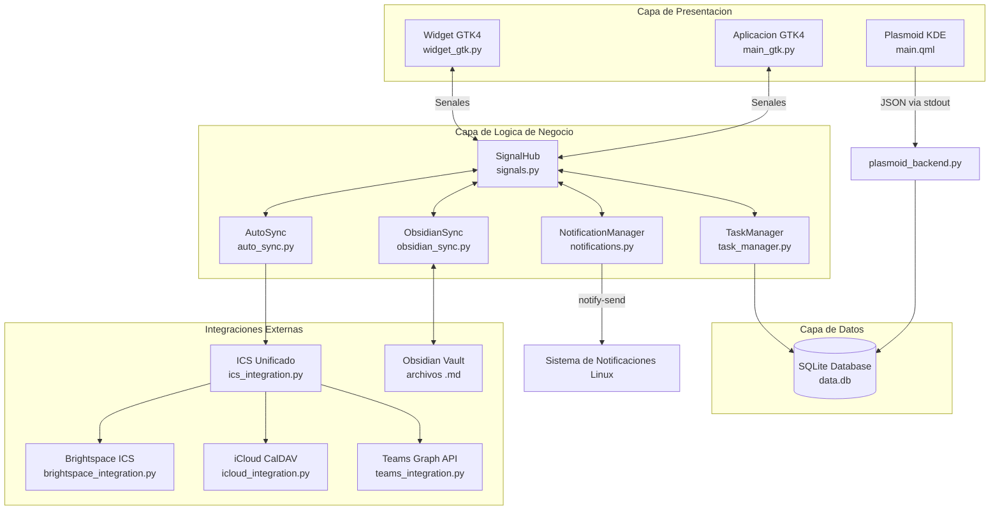
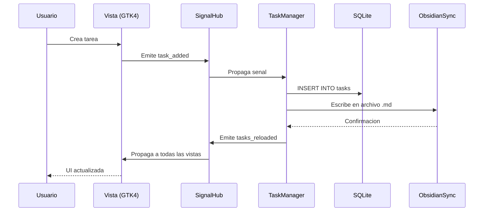
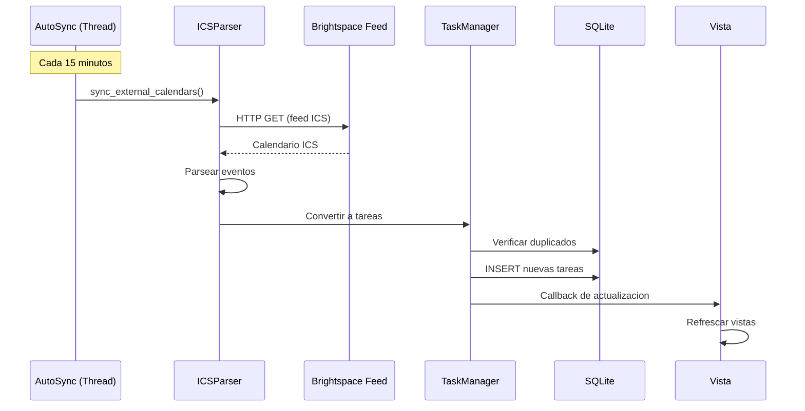
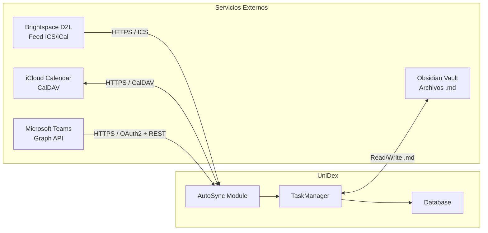
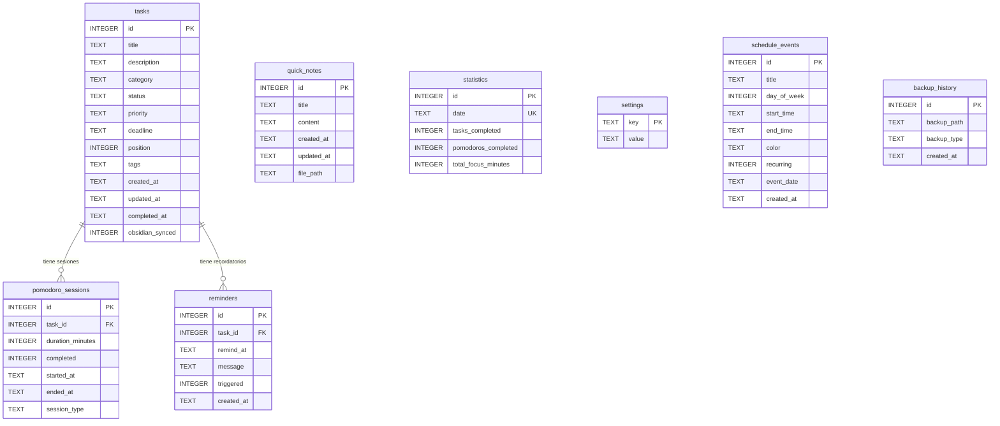

# Manual Tecnico - UniDex

# Historial de versiones

| Fecha | Version | Autor | Organizacion | Descripcion | Contacto Tecnico |
|-------|---------|-------|--------------|-------------|------------------|
| 06/02/2026 | 1.0 | Julian Leon | [Pendiente de completar] | Version inicial del manual tecnico | [Pendiente de completar] |

---

## 1. Introduccion

El presente Manual Tecnico tiene como objetivo proporcionar una guia detallada sobre la instalacion, configuracion, operacion, mantenimiento e integracion del producto **UniDex** en su version **1.0.0**. Esta dirigido principalmente a personal tecnico, desarrolladores e integradores que requieran un conocimiento profundo de su funcionamiento.

Este documento recopila toda la informacion tecnica relevante del producto, incluyendo su arquitectura, componentes, especificaciones, dependencias, requisitos de entorno y procedimientos tecnicos necesarios para garantizar su correcto uso y operacion.

Se incluyen lineamientos para la deteccion y solucion de problemas comunes, tareas de mantenimiento preventivo y correctivo, asi como recomendaciones de seguridad y buenas practicas operativas.

La finalidad de este manual es asegurar la correcta implementacion y continuidad operativa del sistema, reducir riesgos tecnicos y facilitar la transferencia de conocimiento tecnico entre equipos.

---

## 2. Informacion general

**UniDex** es una aplicacion de productividad nativa para Linux disenada para el entorno de escritorio Fedora con KDE Plasma y GNOME. Integra gestion de tareas con tablero Kanban, calendario mensual, horario semanal, temporizador Pomodoro, notas rapidas y estadisticas de productividad, todo con sincronizacion bidireccional con Obsidian y soporte para importacion de calendarios academicos desde Brightspace D2L e iCloud.

**Componentes clave:**
- **Aplicacion principal GTK4:** Interfaz completa con todas las funcionalidades (1200x700px minimo).
- **Widget de escritorio GTK4:** Panel compacto (520x380px) que permanece visible en el escritorio.
- **Widget KDE Plasma (Plasmoid):** Widget nativo de KDE Plasma 6 con backend Python.
- **Integraciones externas:** Brightspace D2L (ICS), iCloud Calendar (CalDAV), Microsoft Teams (Graph API), Obsidian (Markdown).

---

## 3. Objetivos

1. Proveer una aplicacion de productividad nativa de Linux que centralice tareas, calendario y timer de productividad en una sola herramienta.
2. Implementar sincronizacion bidireccional con Obsidian para permitir la gestion de tareas tanto desde la aplicacion como desde el editor de notas.
3. Importar automaticamente fechas limite academicas desde plataformas LMS (Brightspace D2L) mediante feeds ICS.
4. Ofrecer un widget de escritorio compacto que presente informacion relevante del dia sin necesidad de abrir la aplicacion completa.
5. Mantener una arquitectura modular y desacoplada que facilite la extension futura del sistema, incluyendo una posible migracion a Flutter para soporte multiplataforma.

---

## 4. Caracteristicas del Producto

**Tecnologias Utilizadas:**

| Componente | Tecnologia | Version |
|------------|------------|---------|
| Lenguaje de programacion | Python | 3.13 |
| Framework GUI principal | GTK4 + Libadwaita | 4.0+ / 1.x |
| Framework GUI legacy | PyQt6 | 6.4+ |
| Widget KDE | QML (Qt Quick) | 6.0+ |
| Base de datos | SQLite | 3.x (embebida en Python) |
| Protocolo de calendario | CalDAV / ICS (RFC 5545) | - |
| API externa | Microsoft Graph API | v1.0 |
| Sincronizacion de notas | Obsidian Markdown | - |

**Dependencias Python (GTK):**

| Paquete | Version | Proposito |
|---------|---------|-----------|
| PyGObject | >= 3.42.0 | Bindings GTK4 para Python |
| pycairo | >= 1.20.0 | Renderizado de graficos Cairo |
| icalendar | >= 5.0.0 | Parseo de archivos ICS |
| caldav | >= 1.0.0 | Protocolo CalDAV para iCloud |
| requests | >= 2.28.0 | Peticiones HTTP para feeds ICS |

**Dependencias del Sistema (Fedora):**

| Paquete | Proposito |
|---------|-----------|
| gtk4-devel | Libreria GTK4 |
| libadwaita-devel | Libreria Adwaita para GNOME |
| python3-gobject | GObject Introspection para Python |
| python3-pip | Gestor de paquetes Python |

---

## 5. Arquitectura del Sistema

### Descripcion General

UniDex sigue un patron **MVC modificado** con un **hub de senales centralizado** para la comunicacion reactiva entre componentes. La arquitectura es modular y desacoplada: la capa de presentacion (GTK4/QML) se comunica con la logica de negocio a traves de senales, y esta a su vez persiste datos en una base de datos SQLite embebida.

El sistema se compone de una interfaz de usuario desarrollada en GTK4 con Libadwaita, una capa core de logica de negocio en Python puro, una base de datos SQLite para almacenamiento persistente, y multiples modulos de integracion que conectan con servicios externos (Brightspace, iCloud, Teams, Obsidian).

### Diagrama de Arquitectura



### Diagrama de Flujo de Datos



### Diagrama de Sincronizacion Automatica



### Componentes Principales

| Componente | Descripcion | Tecnologias |
|------------|-------------|-------------|
| Frontend GTK4 | Interfaz de usuario principal con sidebar, vistas y dialogos | Python, GTK4, Libadwaita, CSS |
| Frontend QML | Widget nativo de KDE Plasma | QML, Qt Quick 6 |
| Backend Core | Logica de negocio: TaskManager, ObsidianSync, AutoSync, Notifications | Python puro |
| SignalHub | Bus de eventos centralizado para comunicacion reactiva entre componentes | Python (GenericSignal) |
| Base de Datos | Almacenamiento persistente con 8 tablas y migraciones automaticas | SQLite 3 |
| Plasmoid Backend | Script Python que alimenta al widget QML con datos JSON | Python, SQLite |
| Integracion Brightspace | Importacion de fechas limite via feed ICS | Python, icalendar |
| Integracion iCloud | Sincronizacion bidireccional via CalDAV | Python, caldav |
| Integracion Teams | Lectura de eventos via Microsoft Graph API | Python, requests, OAuth2 |
| Integracion Obsidian | Sincronizacion bidireccional con archivos Markdown | Python, I/O de archivos |

---

## 6. Instalacion y Configuracion

### Requisitos del Sistema

**Hardware minimo:**

| Recurso | Minimo Recomendado |
|---------|--------------------|
| CPU | 2 nucleos x86_64 |
| RAM | 2 GB |
| Almacenamiento | 200 MB SSD |
| Pantalla | 1366x768 |

**SO compatible:**
- Fedora Linux 41+ (recomendado)
- Ubuntu 22.04+
- Cualquier distribucion Linux con GTK4 4.0+ y Libadwaita 1.x

**Dependencias:**
- Python 3.10+ (3.13 recomendado)
- GTK4 >= 4.0
- Libadwaita >= 1.0
- PyGObject >= 3.42.0
- Fuente: Source Code Pro (recomendada)

### Infraestructura Requerida

| Recurso | Minimo Recomendado |
|---------|--------------------|
| CPU | 2 nucleos |
| RAM | 2 GB |
| Almacenamiento | 200 MB SSD |
| Sistema Operativo | Fedora 41+ / Ubuntu 22.04+ |
| Entorno de ejecucion | Python 3.13, GTK4 4.0, Libadwaita 1.0 |
| Display Server | Wayland (recomendado) o X11 |

### Pasos de Instalacion

**Paso 1: Instalar dependencias del sistema**

Fedora:
```bash
sudo dnf install gtk4-devel libadwaita-devel python3-gobject python3-pip
```

Ubuntu/Debian:
```bash
sudo apt install libgtk-4-dev libadwaita-1-dev python3-gi python3-pip
```

**Paso 2: Clonar el repositorio**
```bash
git clone <url-repositorio> CalendarWidget
cd CalendarWidget
```

**Paso 3: Ejecutar el instalador**
```bash
chmod +x install.sh
./install.sh
```

El script realiza las siguientes operaciones:
1. Verifica que Python3, GTK4 y Libadwaita esten disponibles.
2. Crea los directorios de instalacion en `~/.local/share/unidex/`.
3. Copia los archivos fuente (`src/`, `assets/`, scripts Python).
4. Crea un entorno virtual con `--system-site-packages` e instala dependencias de `requirements_gtk.txt`.
5. Instala el icono de la aplicacion en `~/.local/share/icons/`.
6. Crea scripts de lanzamiento en `~/.local/bin/` (`unidex`, `unidex-widget`).
7. Genera archivos `.desktop` en `~/.local/share/applications/`.
8. Configura autostart del widget en `~/.config/autostart/`.
9. Actualiza la base de datos de aplicaciones del escritorio.

**Paso 4 (Opcional): Instalar Plasmoid de KDE**
```bash
chmod +x install_plasmoid_direct.sh
./install_plasmoid_direct.sh
```

Este script copia el plasmoid a `~/.local/share/plasma/plasmoids/com.jjjulianleon.unidex/` y reinicia plasmashell.

**Paso 5: Verificar instalacion**
```bash
unidex        # Debe abrir la aplicacion principal
unidex-widget # Debe mostrar el widget en el escritorio
```

### Parametros de Configuracion

**Configuracion de la aplicacion (tabla `settings` en SQLite):**

| Parametro | Descripcion | Valor por Defecto |
|-----------|-------------|-------------------|
| `pomodoro_work` | Duracion de sesion de trabajo (minutos) | `25` |
| `pomodoro_short_break` | Duracion de descanso corto (minutos) | `5` |
| `pomodoro_long_break` | Duracion de descanso largo (minutos) | `15` |
| `pomodoro_sessions` | Sesiones antes de descanso largo | `4` |
| `theme` | Tema visual de la aplicacion | `dark` |
| `language` | Idioma de la interfaz | `es` |

**Constantes de la aplicacion (`src/utils/constants.py`):**

| Parametro | Descripcion | Valor por Defecto |
|-----------|-------------|-------------------|
| `APP_NAME` | Nombre de la aplicacion | `UniDex` |
| `APP_VERSION` | Version actual | `1.0.0` |
| `SEMESTER_START` | Inicio del semestre | `2026-01-12` |
| `SEMESTER_END` | Fin del semestre | `2026-05-16` |
| `WIDGET_WIDTH` | Ancho del widget (px) | `520` |
| `WIDGET_HEIGHT` | Alto del widget (px) | `320` |
| `MAIN_APP_MIN_WIDTH` | Ancho minimo de la app (px) | `1200` |
| `MAIN_APP_MIN_HEIGHT` | Alto minimo de la app (px) | `700` |
| `SCHEDULE_START_HOUR` | Hora inicio del horario | `6` |
| `SCHEDULE_END_HOUR` | Hora fin del horario | `22` |
| `NOTIFICATION_THRESHOLDS` | Dias antes del deadline para alertas | `[0, 1, 3]` |

**Rutas del sistema:**

| Ruta | Contenido |
|------|-----------|
| `~/.local/share/UniDex/data.db` | Base de datos SQLite |
| `~/.local/share/UniDex/backups/` | Backups automaticos y manuales |
| `~/.config/calendar_widget/ics_config.json` | Configuracion de feeds ICS |
| `~/.config/calendar_widget/icloud_config.json` | Credenciales iCloud CalDAV |
| `~/.config/calendar_widget/ms_token.json` | Token OAuth2 de Microsoft |
| `~/.config/calendar_widget/brightspace_cache.json` | Cache de deadlines |
| `~/.config/calendar_widget/cache/` | Cache de archivos ICS descargados |

---

## 7. Integraciones

### Diagrama General de Integraciones



| Sistema | Tipo de Integracion | Protocolo | Interfaz | Descripcion | Observaciones |
|---------|---------------------|-----------|----------|-------------|---------------|
| Brightspace D2L | Feed de calendario | HTTPS | ICS (RFC 5545) | **Endpoint:** URL del feed ICS de Brightspace. **Metodo:** GET. **Parametros:** Ninguno (URL autenticada por token). **Respuesta esperada:** Archivo ICS con eventos VCALENDAR/VEVENT | Sincronizacion automatica cada 15 min. Cache de 30 minutos |
| iCloud Calendar | Calendario bidireccional | HTTPS | CalDAV (RFC 4791) | **Endpoint:** `https://caldav.icloud.com/`. **Metodo:** PROPFIND, REPORT, PUT. **Autenticacion:** Apple ID + App-specific password | Requiere contrasena de aplicacion de Apple |
| Microsoft Teams | Calendario de eventos | HTTPS | REST API (Microsoft Graph v1.0) | **Endpoint:** `https://graph.microsoft.com/v1.0/me/calendarview`. **Metodo:** GET. **Autenticacion:** OAuth2 Bearer Token. **Respuesta esperada:** JSON con array de eventos | Requiere registro de app en Azure AD. Estado: pendiente de credenciales |
| Obsidian | Sincronizacion de tareas | Filesystem | Archivos Markdown (.md) | **Lectura/escritura** directa de archivos en el vault de Obsidian. Formato: listas de tareas Markdown con metadatos inline | Bidireccional. Rutas configuradas en constants.py |

---

## 8. Seguridad

### Autenticacion y Autorizacion

- **Aplicacion local:** UniDex es una aplicacion de escritorio local. No implementa un sistema de autenticacion propio ya que se ejecuta bajo las credenciales del usuario del sistema operativo.
- **iCloud CalDAV:** Utiliza autenticacion basica sobre HTTPS con Apple ID y contrasena especifica de aplicacion (App-Specific Password).
- **Microsoft Teams:** Utiliza OAuth2 con flujo de autorizacion via navegador. Los tokens se almacenan localmente en `~/.config/calendar_widget/ms_token.json`.
- **Brightspace D2L:** La URL del feed ICS contiene un token de autenticacion embebido proporcionado por la plataforma.

### Manejo de Datos Sensibles

**Almacenamiento de credenciales:**
- Las credenciales de iCloud se almacenan en texto plano en `~/.config/calendar_widget/icloud_config.json`. Se recomienda restringir los permisos del archivo:
  ```bash
  chmod 600 ~/.config/calendar_widget/icloud_config.json
  ```
- Los tokens OAuth2 de Microsoft se almacenan en `~/.config/calendar_widget/ms_token.json` con el mismo riesgo.
- **Recomendacion:** En futuras versiones, implementar cifrado de credenciales usando el keyring del sistema (GNOME Keyring o KWallet).

**Cifrado en transito:**
- Todas las comunicaciones externas (Brightspace, iCloud, Teams) se realizan sobre HTTPS/TLS.
- La base de datos SQLite es local y no se transmite por red.

**Permisos de archivos:**
- El directorio `~/.config/calendar_widget/` debe tener permisos `700`.
- Los archivos de configuracion con credenciales deben tener permisos `600`.

---

## 9. Mantenimiento y Soporte

### Tareas de Mantenimiento Preventivo

| Tarea | Frecuencia | Descripcion |
|-------|------------|-------------|
| Backup automatico | Cada 6 horas | El sistema genera copias de seguridad automaticas de la base de datos en `~/.local/share/UniDex/backups/` |
| Limpieza de cache ICS | Mensual | Eliminar archivos antiguos en `~/.config/calendar_widget/cache/` |
| Actualizacion de dependencias | Trimestral | Actualizar paquetes Python en el entorno virtual |
| Verificacion de integridad de DB | Semanal | Ejecutar `PRAGMA integrity_check` en la base de datos |

### Monitoreo del Sistema

**Logs relevantes:**
- La aplicacion emite mensajes por stdout/stderr cuando se ejecuta desde terminal.
- Las notificaciones de escritorio se envian via `notify-send` y quedan registradas en el sistema de notificaciones del escritorio.
- Los errores de sincronizacion se reportan via senales (`ics_error`, `notification_triggered`).

**Comando de diagnostico:**
```bash
# Verificar estado de la base de datos
sqlite3 ~/.local/share/UniDex/data.db "PRAGMA integrity_check;"

# Verificar tareas pendientes
sqlite3 ~/.local/share/UniDex/data.db "SELECT COUNT(*) FROM tasks WHERE status='pendiente';"

# Verificar ultimo backup
sqlite3 ~/.local/share/UniDex/data.db "SELECT * FROM backup_history ORDER BY created_at DESC LIMIT 1;"
```

### Respaldo y Recuperacion

**Backups automaticos:**
- Frecuencia: cada 6 horas de uso activo.
- Ubicacion: `~/.local/share/UniDex/backups/`
- Formato: copia completa de la base de datos SQLite.

**Backup manual:**
Desde la aplicacion: Configuracion > Backup/Export. Formatos disponibles:
- **JSON:** Exporta todas las tablas en un archivo JSON estructurado.
- **CSV:** Exporta cada tabla como un archivo CSV independiente.
- **SQLite:** Copia directa del archivo `data.db`.

**Procedimiento de recuperacion:**
1. Localizar el backup mas reciente en `~/.local/share/UniDex/backups/`.
2. Detener la aplicacion y el widget.
3. Reemplazar `~/.local/share/UniDex/data.db` con el archivo de backup.
4. Reiniciar la aplicacion.

| Mantenimiento del Sistema | Valor / Descripcion |
|---------------------------|---------------------|
| Tiempo de respuesta maximo | < 1 segundo para operaciones CRUD |
| Disponibilidad | Depende de la sesion del escritorio |
| Seguridad de la informacion | HTTPS para integraciones externas; datos locales sin cifrado |
| Compatibilidad de escritorio | GNOME 45+, KDE Plasma 6.x |

---

## 10. Estandares y Normativas

### Estandares de Desarrollo

- **PEP 8:** Formato de codigo Python (snake_case para funciones/variables, CamelCase para clases).
- **Type hints:** Se utilizan anotaciones de tipo cuando es posible.
- **Docstrings:** Funciones publicas documentadas con docstrings descriptivos.
- **Patron Singleton:** Utilizado en Database, TaskManager, SignalHub y NotificationManager.

### Estandares de Arquitectura

- **Patron MVC modificado:** Separacion de vistas (GTK4), logica (core) y datos (SQLite).
- **Comunicacion reactiva:** Hub de senales centralizado para desacoplamiento entre componentes.
- **Modularidad:** Cada integracion externa es un modulo independiente que puede habilitarse o deshabilitarse.

### Convenciones de Codigo

```
tipo(modulo): descripcion corta

Descripcion detallada si es necesario.
```

Tipos de commit:
- `feat`: Nueva funcionalidad
- `fix`: Correccion de bug
- `refactor`: Refactorizacion de codigo
- `style`: Cambios de estilo/formato
- `docs`: Documentacion
- `test`: Tests

### Estandares de Calendario

- **RFC 5545 (iCalendar):** Formato utilizado para importacion/exportacion de eventos.
- **RFC 4791 (CalDAV):** Protocolo utilizado para sincronizacion con iCloud Calendar.

### Testing

- **Framework:** unittest (libreria estandar de Python)
- **Tests existentes:** 43 tests unitarios en 3 archivos
  - `tests/test_database.py`: Operaciones CRUD, consultas, backups, exportaciones
  - `tests/test_obsidian_sync.py`: Sincronizacion con archivos Markdown
  - `tests/test_ics_integration_flow.py`: Parseo ICS y flujo de sincronizacion

**Ejecutar tests:**
```bash
cd CalendarWidget
python -m pytest tests/ -v
```

---

## 11. Esquema de Base de Datos

### Diagrama Entidad-Relacion



### Definiciones SQL

**Tabla tasks:**
```sql
CREATE TABLE tasks (
    id INTEGER PRIMARY KEY AUTOINCREMENT,
    title TEXT NOT NULL,
    description TEXT DEFAULT '',
    category TEXT NOT NULL,           -- 'Personal', 'Universidad', 'Fedora'
    status TEXT DEFAULT 'pendiente',  -- 'pendiente', 'en progreso', 'completado'
    priority TEXT DEFAULT 'media',    -- 'alta', 'media', 'baja'
    deadline TEXT,                    -- ISO: 'YYYY-MM-DD'
    position INTEGER DEFAULT 0,
    tags TEXT DEFAULT '[]',           -- JSON array
    created_at TEXT DEFAULT CURRENT_TIMESTAMP,
    updated_at TEXT DEFAULT CURRENT_TIMESTAMP,
    completed_at TEXT,
    obsidian_synced INTEGER DEFAULT 0
);
```

**Tabla quick_notes:**
```sql
CREATE TABLE quick_notes (
    id INTEGER PRIMARY KEY AUTOINCREMENT,
    title TEXT NOT NULL,
    content TEXT DEFAULT '',
    created_at TEXT DEFAULT CURRENT_TIMESTAMP,
    updated_at TEXT DEFAULT CURRENT_TIMESTAMP,
    file_path TEXT
);
```

**Tabla pomodoro_sessions:**
```sql
CREATE TABLE pomodoro_sessions (
    id INTEGER PRIMARY KEY AUTOINCREMENT,
    task_id INTEGER,
    duration_minutes INTEGER DEFAULT 25,
    completed INTEGER DEFAULT 0,
    started_at TEXT DEFAULT CURRENT_TIMESTAMP,
    ended_at TEXT,
    session_type TEXT DEFAULT 'work',  -- 'work', 'short_break', 'long_break'
    FOREIGN KEY (task_id) REFERENCES tasks(id)
);
```

**Tabla statistics:**
```sql
CREATE TABLE statistics (
    id INTEGER PRIMARY KEY AUTOINCREMENT,
    date TEXT NOT NULL UNIQUE,
    tasks_completed INTEGER DEFAULT 0,
    pomodoros_completed INTEGER DEFAULT 0,
    total_focus_minutes INTEGER DEFAULT 0
);
```

**Tabla settings:**
```sql
CREATE TABLE settings (
    key TEXT PRIMARY KEY,
    value TEXT
);
```

**Tabla schedule_events:**
```sql
CREATE TABLE schedule_events (
    id INTEGER PRIMARY KEY AUTOINCREMENT,
    title TEXT NOT NULL,
    day_of_week INTEGER NOT NULL,      -- 0=Lunes, 6=Domingo
    start_time TEXT NOT NULL,          -- 'HH:MM'
    end_time TEXT NOT NULL,            -- 'HH:MM'
    color TEXT DEFAULT '66, 133, 244',
    recurring INTEGER DEFAULT 1,
    event_date TEXT,
    created_at TEXT DEFAULT CURRENT_TIMESTAMP
);
```

**Tabla reminders:**
```sql
CREATE TABLE reminders (
    id INTEGER PRIMARY KEY AUTOINCREMENT,
    task_id INTEGER,
    remind_at TEXT NOT NULL,
    message TEXT,
    triggered INTEGER DEFAULT 0,
    created_at TEXT DEFAULT CURRENT_TIMESTAMP,
    FOREIGN KEY (task_id) REFERENCES tasks(id) ON DELETE CASCADE
);
```

**Tabla backup_history:**
```sql
CREATE TABLE backup_history (
    id INTEGER PRIMARY KEY AUTOINCREMENT,
    backup_path TEXT NOT NULL,
    backup_type TEXT DEFAULT 'manual',  -- 'manual', 'auto'
    created_at TEXT DEFAULT CURRENT_TIMESTAMP
);
```

---

## 12. Estructura del Proyecto

```
CalendarWidget/
├── main_gtk.py                    # Punto de entrada GTK4 + Libadwaita
├── widget_gtk.py                  # Widget de escritorio GTK4 (520x380px)
├── plasmoid_backend.py            # Backend Python para widget KDE Plasma
├── brightspace_integration.py     # Integracion Brightspace D2L (ICS)
├── teams_integration.py           # Integracion Microsoft Teams (Graph API)
├── icloud_integration.py          # Integracion iCloud Calendar (CalDAV)
├── ics_integration.py             # Orquestador unificado de feeds ICS
├── install.sh                     # Script de instalacion para Fedora/GNOME
├── install_plasmoid_direct.sh     # Instalador de widget KDE Plasma
├── uninstall.sh                   # Script de desinstalacion
├── package_plasmoid.sh            # Empaquetador del plasmoid
├── requirements.txt               # Dependencias PyQt6 (legacy)
├── requirements_gtk.txt           # Dependencias GTK4 (activas)
├── README.md                      # Documentacion de usuario
├── Documentacion.md               # Documentacion tecnica previa
├── migracion_futura.md            # Roadmap de migracion a Flutter
├── .gitignore                     # Exclusiones de Git
│
├── src/                           # Codigo fuente principal
│   ├── __init__.py
│   │
│   ├── core/                      # Logica de negocio
│   │   ├── __init__.py
│   │   ├── database.py            # Singleton SQLite con migraciones
│   │   ├── task_manager.py        # CRUD de tareas y notas
│   │   ├── obsidian_sync.py       # Sincronizacion bidireccional Obsidian
│   │   ├── auto_sync.py           # Sincronizacion automatica en background
│   │   ├── notifications.py       # Notificaciones de escritorio (notify-send)
│   │   └── signals.py             # Hub central de senales (GenericSignal)
│   │
│   ├── gtk/                       # Implementacion GTK4
│   │   ├── window.py              # Ventana principal con sidebar
│   │   ├── views/
│   │   │   ├── dashboard.py       # Vista Dashboard
│   │   │   ├── tasks.py           # Vista de tareas
│   │   │   ├── calendar.py        # Vista calendario mensual
│   │   │   └── stats.py           # Vista estadisticas
│   │   ├── widgets/
│   │   │   ├── kanban.py          # Tablero Kanban con drag-and-drop
│   │   │   ├── pomodoro.py        # Temporizador Pomodoro
│   │   │   ├── schedule.py        # Horario semanal
│   │   │   ├── notes.py           # Notas rapidas
│   │   │   └── task_detail.py     # Detalle de tarea
│   │   └── dialogs/
│   │       ├── add_task.py        # Dialogo de creacion de tareas
│   │       └── settings.py        # Dialogo de configuracion
│   │
│   ├── ui/                        # Implementacion PyQt6 (legacy)
│   │   ├── widgets/
│   │   ├── dialogs/
│   │   └── views/
│   │
│   └── utils/                     # Utilidades compartidas
│       ├── constants.py           # Constantes y configuracion global
│       └── styles.py              # Tema glassmorphism y paleta de colores
│
├── plasmoid/                      # Widget KDE Plasma
│   └── package/
│       ├── metadata.json          # Metadatos del plasmoid (Plasma 6)
│       └── contents/ui/
│           ├── main.qml           # Interfaz QML del widget
│           └── ConfigGeneral.qml  # Pagina de configuracion
│
├── tests/                         # Tests unitarios
│   ├── test_database.py           # 43 tests de operaciones de DB
│   ├── test_obsidian_sync.py      # Tests de sincronizacion Obsidian
│   └── test_ics_integration_flow.py # Tests de integracion ICS
│
├── assets/                        # Recursos graficos
│   ├── app_icon.svg               # Icono de la aplicacion (SVG)
│   └── icons/                     # Iconos adicionales
│
├── .devcontainer/                 # Configuracion de Dev Container
│   ├── devcontainer.json          # Config VS Code Remote Containers
│   └── Dockerfile                 # Imagen Docker para desarrollo
│
└── resources/                     # Recursos adicionales (archivos ICS)
```

---

## 13. Solucion de Problemas

| Error Comun | Causa Posible | Solucion |
|-------------|---------------|----------|
| `ModuleNotFoundError: No module named 'gi'` | PyGObject no instalado en el sistema | Ejecutar: `sudo dnf install python3-gobject` (Fedora) o `sudo apt install python3-gi` (Ubuntu) |
| `ValueError: Namespace Gtk not available` | GTK4 no instalado | Ejecutar: `sudo dnf install gtk4-devel` (Fedora) o `sudo apt install libgtk-4-dev` (Ubuntu) |
| `ValueError: Namespace Adw not available` | Libadwaita no instalada | Ejecutar: `sudo dnf install libadwaita-devel` (Fedora) o `sudo apt install libadwaita-1-dev` (Ubuntu) |
| Widget no aparece al iniciar sesion | Archivo de autostart eliminado o corrupto | Verificar existencia de `~/.config/autostart/unidex-widget.desktop`. Ejecutar `install.sh` nuevamente si no existe |
| `QDBusTrayIcon encountered a D-Bus error` | Servicio de bandeja del sistema no disponible | Warning ignorable, no afecta funcionalidad |
| Fondo blanco en dropdowns (QComboBox) | Bug conocido de Qt en Wayland | Sin solucion definitiva; afecta solo la interfaz legacy PyQt6, no la version GTK4 |
| Tareas de Obsidian no se sincronizan | Rutas del vault no coinciden con la configuracion | Verificar rutas en `src/utils/constants.py` (`OBSIDIAN_VAULT_PATHS`). Asegurar que los archivos `.md` existan |
| Error de conexion con Brightspace | URL del feed ICS incorrecta o expirada | Regenerar la URL del feed ICS desde Brightspace > Calendario > Suscribirse |
| Error de autenticacion iCloud | Contrasena de aplicacion invalida | Generar nueva contrasena en [appleid.apple.com](https://appleid.apple.com) > Seguridad > Contrasenas de aplicacion |
| Drag-and-drop parpadea en Kanban | Repintado rapido durante animaciones GTK | Comportamiento conocido, no afecta funcionalidad. Mejorado en la version GTK4 |
| Base de datos corrupta | Cierre inesperado o fallo de disco | Restaurar desde el ultimo backup en `~/.local/share/UniDex/backups/`. Ejecutar `PRAGMA integrity_check` para diagnostico |
| El plasmoid no muestra datos | Ruta del backend hardcodeada incorrectamente | Verificar que `plasmoid_backend.py` este en `~/.local/share/unidex/` y que la ruta en `main.qml` sea correcta |

---

## Anexos

### Glosario de terminos

| Termino | Definicion |
|---------|------------|
| **CalDAV** | Protocolo estandar (RFC 4791) para acceso a calendarios remotos via HTTP/WebDAV |
| **ICS/iCal** | Formato estandar (RFC 5545) para representar eventos de calendario |
| **Glassmorphism** | Estilo de diseno visual con fondos semi-transparentes y efecto de cristal |
| **GTK4** | Toolkit grafico de GNOME para construir interfaces de usuario nativas en Linux |
| **Libadwaita** | Libreria complementaria a GTK4 que implementa los patrones de diseno GNOME |
| **Kanban** | Metodologia de gestion visual de tareas organizada en columnas de estado |
| **Plasmoid** | Widget nativo de KDE Plasma, implementado en QML |
| **Pomodoro** | Tecnica de productividad basada en intervalos de trabajo (25 min) y descanso (5 min) |
| **QML** | Lenguaje declarativo de Qt para construir interfaces de usuario |
| **SignalHub** | Patron de diseno que centraliza la comunicacion por eventos entre componentes |
| **Singleton** | Patron de diseno que garantiza una unica instancia de una clase |
| **OAuth2** | Protocolo de autorizacion estandar para acceso delegado a APIs |
| **Microsoft Graph** | API RESTful de Microsoft para acceder a datos de Office 365 y Teams |

### Referencias tecnicas

- [GTK4 Documentation](https://docs.gtk.org/gtk4/)
- [Libadwaita Documentation](https://gnome.pages.gitlab.gnome.org/libadwaita/)
- [PyGObject API Reference](https://lazka.github.io/pgi-docs/)
- [RFC 5545 - iCalendar](https://datatracker.ietf.org/doc/html/rfc5545)
- [RFC 4791 - CalDAV](https://datatracker.ietf.org/doc/html/rfc4791)
- [Microsoft Graph API](https://learn.microsoft.com/en-us/graph/overview)
- [Python sqlite3 Module](https://docs.python.org/3/library/sqlite3.html)
- [Obsidian](https://obsidian.md)
- [KDE Plasma Widget Development](https://develop.kde.org/docs/plasma/)

### Manual de usuario

Ver archivo `Manual_Usuario.md` incluido en el proyecto.

### Enlaces relevantes

- **Repositorio del proyecto:** [Pendiente de completar]
- **Roadmap de migracion a Flutter:** Ver `migracion_futura.md`
- **Documentacion tecnica previa:** Ver `Documentacion.md`

---

**Ultima actualizacion:** Febrero 2026
**Autor:** Julian Leon
**Licencia:** MIT
